<div align="center">


<br/>

[](https://github.com/DevrisOfStar)
[](https://github.com/DevrisOfStar?tab=repositories)

</div>

---

### 👨‍💻 About Me

```text
🎓  Dongguk University
💻  Backend · Android · Full-stack
🧩  Algorithm PS — BOJ · SWEA · Programmers
🌱  Exploring Kotlin, Docker & AI
```

<br/>

### 🛠️ Tech Stack

**Languages**


**Tools & Platforms**


<br/>

### 📊 GitHub Analytics

<div align="center">






</div>

<br/>

### 🚀 Featured Projects

| | Project | Description |
|:---:|:---|:---|
| 🌐 | [**portfolio**](https://github.com/DevrisOfStar/portfolio) | Personal portfolio website |
| 📱 | [**MGData-AOS**](https://github.com/DevrisOfStar/MGData-AOS) | NAS file & Docker management app with ChatGPT |
| 🤖 | [**ssafyChatbot**](https://github.com/DevrisOfStar/ssafyChatbot) | Python-based chatbot project |

<br/>

### 🧩 Problem Solving

알고리즘 PS 기록을 플랫폼별 저장소에 정리해 두고 있습니다.

| Platform | Repository | Description |
|:---:|:---|:---|
| 백준 · BOJ | [**acmicpc**](https://github.com/DevrisOfStar/acmicpc) | Java로 풀이한 백준 문제 모음 |
| SW Expert Academy | [**SWEA**](https://github.com/DevrisOfStar/SWEA) | 삼성 SW 역량테스트 대비 풀이 |
| 프로그래머스 | [**Programmers**](https://github.com/DevrisOfStar/Programmers) | 코딩 테스트 연습 기록 |

<br/>

[](https://github.com/DevrisOfStar/acmicpc)
[](https://github.com/DevrisOfStar/SWEA)
[](https://github.com/DevrisOfStar/Programmers)

<br/>

### 📫 Connect

[](https://github.com/DevrisOfStar)
[](mailto:yh1483@naver.com)
[](https://github.com/DevrisOfStar/portfolio)

<br/>

---

<div align="center">


</div>
